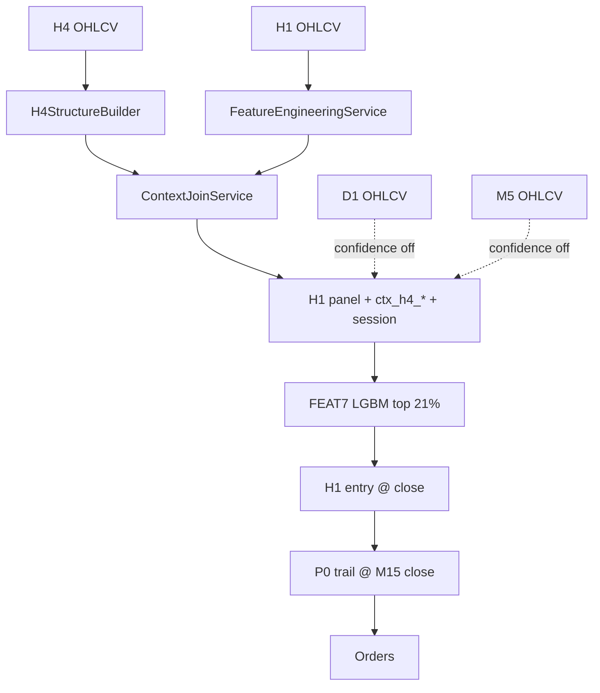
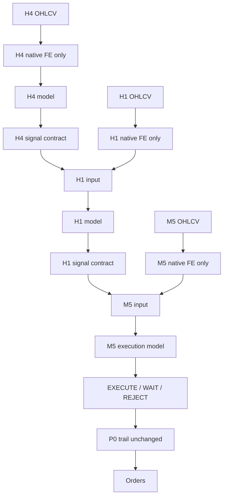

# MTF Hierarchical Research Audit — H4 → H1 → M5

**Phase:** 1 (Repository audit only)  
**Date:** 2026-08-22  
**Status:** STOP — findings presented; no architectural changes made yet  
**Scope:** XAUUSD, H4/H1/M5 only (D1 out of scope for this sprint)

---

## Executive summary

The repository already has **strong single-stack infrastructure** (H1 FEAT7 primary, causal H4 context join, rolling walk-forward, vectorized exit replay, multi-trade portfolio sim, Monte Carlo utilities). What it **does not have** is a **hierarchical signal-contract pipeline** where H4 and H1 emit abstract parent signals and child layers consume only those contracts.

**Current production** is a **flat merge architecture**:

```
H4 raw features ──join──► H1 feature panel ──► FEAT7 LGBM ──► H1 entry
M5/D1 raw features ──join──► confidence only (disabled in prod)
H1 entry ──► P0 ATR trail on M15 close ──► execution
```

**Requested research architecture** is a **chain architecture**:

```
H4 native features ──► H4 model ──► H4 signal contract
                                         │
H1 native features + H4 signal ──► H1 model ──► H1 signal contract
                                                    │
M5 native features + H1 signal ──► M5 execution model ──► EXECUTE/WAIT/REJECT
```

These are **not equivalent**. Migrating requires new signal entities, WF dependency ordering (H4 OOS → H1 OOS → M5 OOS), and retiring or ablating the current `ctx_h4_*` direct-merge pattern in the H1 model input.

---

## Comparison: production today vs hierarchical target

| Dimension | **Production now** (`prod_v5_feat7_top21_a025_d008_lot01_daily80_m15trail`) | **Hierarchical target (this sprint)** |
|---|---|---|
| **H4 role** | Deterministic feature builder; **no H4 model** | Independent H4 model → **signal contract** |
| **H4 → H1 info flow** | Raw `ctx_h4_*` merged into H1 panel (7 cols in v2 dataset) | **Only** `{direction, probability, regime, signal_ts, available_ts}` |
| **H1 model** | FEAT7 LGBM (7 features, includes 1× `ctx_h4_swing_quality`) | H1 native + **H4 parent signal** (no raw H4 OHLC/features) |
| **H1 → M5 info flow** | None for execution; M5 used only for optional confidence | **Only H1 signal contract** |
| **M5 role** | Not in execution path; research sprints 48–55 only | Execution timing model (EXECUTE/WAIT/REJECT) |
| **Entry TF** | H1 close | H1 close (baseline unchanged) |
| **Exit TF** | M15 close trail (P0 a0.25/d0.08) | Same TP/SL/trail/sizing (baseline immutable) |
| **Gate** | Top 21% rolling percentile | Same for H1 unless explicitly changed in experiment |
| **WF protocol** | 5y train / 1y val / 1y test per H1 model | **Chained WF**: H4 OOS → feed H1 → H1 OOS → feed M5 |
| **Signal contract type** | Implicit DataFrame columns | Explicit typed contract + tests |
| **D1** | Joined in live for confidence (disabled) | **Out of scope** |

### Production stack (frozen knobs)

Source: `production/__init__.py`

| Knob | Value |
|---|---|
| Primary features (FEAT7) | `hour_cos`, `atr_percentile_252`, `ema_trend_duration`, `rolling_quantile`, `hour_sin`, `atr_percent`, `ctx_h4_swing_quality` |
| Gate | `PRIMARY_TOP_PCT = 0.21` |
| SL | `SL_ATR_MULT = 1.5` |
| Trail | activate `0.25R`, distance `0.08 ATR` |
| Trail clock | **M15 close** (`TRAIL_TIMEFRAME = "M15"`, horizon 48 H1 bars → 192 M15 bars) |
| Sizing | fixed lot `0.01`, heat budget `3R`, max_open `5` |
| Daily stop | 1R while equity ≤ `$80` |
| Pipeline version | `prod_v5_feat7_top21_a025_d008_lot01_daily80_m15trail` |

### Known OOS research numbers vs production clock

Same H1 FEAT7 entries, different exit clock (`artifacts/pipeline_backtest/`):

| Stack | OOS PF (2022–26) | OOS max DD | Notes |
|---|---:|---:|---|
| **Production clock (M15 trail)** | **1.33** | **53.8%** | `m5_full_execution` → `P0_M15`; matches live trail clock |
| H1 trail (legacy research) | 2.24 | 32.8% | `P0_H1`; **not** production clock |
| M5 full execution | 1.07 | ~99% | Entry+exit M5; **not shipped** |
| SCHEMA31 entry (M15 trail) | 1.40 | 30.8% | `feat7_vs_schema31`; still flat merge, not hierarchical |

**Implication for this sprint:** baseline backtest must use **M15 causal trail** (`research_m5_full_execution._replay_m5_from_signal`, fill=`h1_close`) and production portfolio config (`CFG_PROD` in `research_sprint40_iter1_time_aware_exit.py`), not `simulation/wf/sim.replay_trail()` defaults (H1 clock, top 5%, max_open=1).

---

## 1. Existing components

### 1.1 Raw market data

| TF | Path | Format |
|---|---|---|
| H1 | `artifacts/raw/XAUUSD/H1/data.parquet` | Parquet, UTC open-time |
| H4 | `artifacts/raw/XAUUSD/H4/data.parquet` | Parquet |
| M5 | `artifacts/raw/XAUUSD/M5/data.parquet` | Parquet |
| M15 | `artifacts/raw/XAUUSD/M15/data.parquet` | Parquet (trail clock) |

Loader: `data/repositories/market_repository.py`, `simulation/wf/sim.load_h1()`.

Legacy flat CSV aliases exist in `settings/paths.py` — research scripts use nested parquet.

### 1.2 H4 feature pipeline

| Component | Path | Output |
|---|---|---|
| H4 context (Sprint 9) | `market_context/builders/h4_context_builder.py` | 7× `ctx_h4_*` regime features |
| H4 structure (Sprint 11) | `market_context/builders/h4_structure_builder.py` | 17× `ctx_h4_*` structure features |
| Causal join | `market_context/services/context_join_service.py` | `available_at = open + bar_duration` |
| Duration utils | `market_context/services/timeframe_utils.py` | H4 = +4h |
| Orchestrator | `market_context/usecases/run_market_context.py` | `artifacts/context/{SYMBOL}/{TF}/context.parquet` |
| Dataset v2 glue | `market_context/services/dataset_v2_builder.py` | merges H1 feats + context + labels |
| H4 structure research | `research/h4_structure/` | **Ablation of ctx features inside H1 model**, not standalone H4 engine |

**Important:** `research/h4_structure/services/experiment_catalog.py` experiments are all `H1 features + ctx_h4_*` — the opposite of the requested parent-signal abstraction.

**H4 model:** **None in production.** `StructureWalkForwardRunner` trains LightGBM on **H1-labeled panels** with structure features added — not an H4-bar prediction target.

### 1.3 H1 feature pipeline

| Component | Path |
|---|---|
| CLI | `apps/generate_features.py` |
| Service | `feature_engineering/services/feature_engineering_service.py` |
| Builders | `feature_engineering/builders/{trend,volatility,momentum,candle,session,statistical}_builder.py` |
| Dataset v2 | `artifacts/datasets/XAUUSD/H1/{long,short}/v2/{train,validation,test,sealed}.parquet` |
| Labels join | `datasets/builders/dataset_builder.py` |

**Columns in v2 long dataset (68,274 rows):** ~40 H1-native features + 7× `ctx_h4_*` (Sprint 9 set only in stored v2):

```
ctx_h4_compression, ctx_h4_expansion, ctx_h4_market_regime,
ctx_h4_swing_quality, ctx_h4_trend_direction, ctx_h4_trend_strength,
ctx_h4_volatility_regime
```

Sprint-11 structure features (swing distances, BOS, etc.) are **not** in stored v2 parquet — computed on demand in live/research via `H4StructureBuilder`.

### 1.4 H1 model (production)

| Item | Path |
|---|---|
| Feature list | `production/__init__.py` → `PRIMARY_FEATURES` |
| Frozen boosters | `artifacts/models/frozen/primary_{long,short}.txt` |
| Export | `production/live/primary_export.py` |
| WF training | `apps/run_rolling_walkforward.py` → `train_frozen()` |
| Cached entry panel | `artifacts/pipeline_backtest/rolling_wf/sprint38_prod_yearly/entry_panel_top21.parquet` (6,854 entries, 2021–26) |
| Live scoring | `production/live/signal_source.py` + `production/live/features.py` |

Live panel assembly (`LiveFeatureBuilder.build_panel`):

1. H1 → `FeatureEngineeringService`
2. H4 → `H4StructureBuilder` → `ContextJoinService` (all structure cols)
3. Session flags
4. D1 + M5 → `asof_join` for confidence (not primary model)

Primary model uses only `PRIMARY_FEATURES` (7 cols); context sets differ by side via `LONG_STRUCTURE_CONTEXT` / `SHORT_STRUCTURE_CONTEXT` in experiment catalog but **production primary is FEAT7 only**.

### 1.5 M5 / recovery logic (research only)

| Sprint | Script | Focus |
|---|---|---|
| 48 | `apps/research_sprint48_execution.py` | Fill realism |
| 49 | `apps/research_sprint49_early_suppression.py` | Early loss suppression (H1 state) |
| 50 | `apps/research_sprint50_m5_execution.py` | Sprint 49 at M5 resolution |
| 51 | `apps/research_sprint51_m5_discovery.py` | Post-entry deterioration |
| 52 | `apps/research_sprint52_m5_management.py` | HOLD/EXIT; `sprint52_m5_path.parquet` |
| 53 | `apps/research_sprint53_thesis.py` | Thesis invalidation |
| 54 | `apps/research_sprint54_recovery.py` | Underwater recovery (`y_recover = p0_R > 0`) |
| 55 | `apps/research_sprint55_price_vs_time.py` | Price vs time attribution |
| — | `apps/research_m5_full_execution.py` | M5 entry fill + trail variants |
| — | `apps/research_m15_trail.py` | H1/M15/M5 trail compare |
| — | `apps/research_m5_trail_frequency.py` | P0–P3 on M5 closes |

**Convention:** H1 signal frozen; M5 path starts at first M5 bar **after** H1 entry; production **not changed** in all sprints.

**M5 feature vocabularies (two parallel, not unified):**

1. Confidence layer: `research/confidence_layer/services/mtf_context.py` → `m5_entry_quality`, `m5_body_ratio`, …
2. Sprint path state: `current_R`, `mae_so_far_R`, `mfe_so_far_R`, `bars_in_trade`, … (trade lifecycle, not pre-entry execution)

Neither implements **H1-signal-conditioned M5 execution timing** as specified in the sprint brief.

### 1.6 Labels

| Item | Path / detail |
|---|---|
| Primary strategy | `labels/strategies/triple_barrier.py` |
| Version | `triple_barrier_v1` |
| Storage | `artifacts/labels/XAUUSD/H1/{side}/triple_barrier_v1.parquet` |
| Config default | `horizon: 8`, `tp_atr_mult: 2.0`, `sl_atr_mult: 1.5` (`configs/config.example.yaml`) |
| Label values | Ternary: `-1`, `0`, `1` (not binary) |
| Exit sim horizon | CAP = **48 H1 bars** in exit research (≠ label horizon 8) |

M5 sprints define **separate labels** (`y_recover`, `large_loss_1`, `thesis_invalid`, etc.) — must not be confused with H1 triple barrier or M5 execution label in §16 of brief.

### 1.7 Walk-forward framework

| Item | Path |
|---|---|
| Main runner | `apps/run_rolling_walkforward.py` |
| Protocol | 5y train / 1y val / 1y test; test years 2021–2026 |
| Training | `train_frozen()` — LightGBM, early stop on val year |
| Entries | `build_test_entries()` — best side per bar, top_pct gate |
| DB | `production/db/wf_writer.py` → Postgres `research.wf_*` |
| Audit | `apps/audit_rolling_walkforward.py` |

**Gap:** Single-model WF only. No orchestration for H4→H1→M5 dependency chain.

### 1.8 Backtest / execution engines

| Engine | Path | Role |
|---|---|---|
| Vectorized exit | `apps/run_exit_engine_grid.py` → `Paths`, `simulate_combo()` | P0 replay on precomputed R paths (CAP=48) |
| Multi-trade portfolio | `apps/report_multi_trade_engine.py` → `run_multi()` | max_open, heat, cooldown |
| Core sim | `simulation/wf/sim.py` → `run_portfolio()`, `replay_trail()` | Legacy H1-bar trail |
| M15 production clock | `apps/research_m5_full_execution.py` → `_replay_m5_from_signal(fill="h1_close")` | **Use for prod-faithful baseline** |
| Entry panel (FEAT7) | `apps/run_exit_engine_grid.py` → `build_entry_panel(top_pct=0.21)` | Shared frozen entries |

Production portfolio winner: `CFG_PROD = parallel_mo5_d0.0_cd0_h3.0` (`research_sprint40_iter1_time_aware_exit.py`).

### 1.9 Monte Carlo utilities

| Utility | Path | Method |
|---|---|---|
| `iter6_montecarlo` | `apps/report_adaptive_vol_risk.py` | 1000× PnL shuffle → ruin/DD |
| `_mc` wrapper | `apps/research_sprint46_loss_reduction.py` | Used in sprint 42–55 reports |
| Trade-order MC | `research/portfolio_backtest/services/monte_carlo.py` | Full portfolio re-run |
| Heat MC | `research/portfolio_heat/services/monte_carlo.py` | Heat budget scenarios |

**Convention:** MC on **final OOS trade PnL list only** — never in-sample (aligned with brief §30).

### 1.10 Experiment / report structure

Existing pattern:

```
artifacts/pipeline_backtest/
  rolling_wf/          # WF entry comparisons
  exit_structure/      # sprint 40–55, M5 research
  loss_reduction/      # sprint 46–49
```

Reports: `summary.md`, `verdict.json`, CSV tables per sprint.

Target structure from brief (`results/mtf_h4_h1_m5/`) **does not exist yet** — should be created in later phases without duplicating sprint folders.

### 1.11 Automated tests (temporal / leakage)

| Test | Path | Covers |
|---|---|---|
| H4 causal join boundary | `tests/test_h4_structure.py` → `test_causal_join_hides_incomplete_bar` | H4 bar not visible before `available_at` |
| Context impact | `tests/test_context_impact.py` | Synthetic ctx panels |
| Confidence MTF | `tests/test_confidence_layer.py` | D1/M5 asof |

**Missing tests (required by brief):** H4→H1 signal contract boundaries, H1→M5 boundaries, parent WF dependency, forward-fill policy, DST/session edge cases.

---

## 2. Reusable components (do not duplicate)

| Need | Reuse |
|---|---|
| Raw OHLCV load | `MarketRepository`, `load_h1()`, parquet paths above |
| H4 native FE | `H4StructureBuilder`, `H4ContextBuilder` (pick one canonical set for H4 engine) |
| Causal TF join | `ContextJoinService` + `available_at()` |
| H1 native FE | `FeatureEngineeringService` + v2 dataset |
| H1 WF train/score | `train_frozen()`, `build_test_entries()`, `score_test()` |
| Production exit | `simulate_combo(P0)`, `_replay_m5_from_signal` (M15) |
| Production portfolio | `run_multi()` + `CFG_PROD` |
| OOS years | `TRUE_OOS = (2022, 2023, 2024, 2025, 2026)` from `research_sprint42_attribution.py` |
| MC | `iter6_montecarlo` / `_mc` |
| Charts/report MD | `_md()` helper, sprint summary pattern |
| Leakage test pattern | Extend `tests/test_h4_structure.py` |

---

## 3. Missing components

| # | Component | Notes |
|---|---|---|
| 1 | **`H4SignalContract` entity** | `{direction, probability, regime, signal_timestamp, available_timestamp, model_version, fold_id}` |
| 2 | **`H1SignalContract` entity** | Same fields + optional setup state |
| 3 | **`M5ExecutionDecision` entity** | EXECUTE / WAIT / REJECT + timestamps |
| 4 | **H4 standalone model + label** | Must inspect protocol before inventing (brief §6); no prod H4 model today |
| 5 | **H4 WF runner emitting OOS signals** | Feed child H1 only OOS preds per fold |
| 6 | **H1 model input without raw ctx_h4_*** | Replace merge with parent signal columns |
| 7 | **M5 native FE builder** (pre-entry) | Brief §11 groups; separate from path-state features |
| 8 | **H1-conditioned M5 features** | Brief §12; alignment, pullback, recovery vs H1 signal |
| 9 | **M5 execution label** | TP-before-SL from existing trail semantics; purge/embargo if overlapping |
| 10 | **Chained WF orchestrator** | H4 OOS → H1 OOS → M5 OOS → backtest |
| 11 | **Experiments A–D harness** | Baseline, fixed delay, rules, ML |
| 12 | **Ablation B/C framework** | H1-only vs H4→H1 vs H4→H1→M5 |
| 13 | **Cost stress (+25/50/100%)** | Partially in sprint 48; not standardized end-to-end |
| 14 | **10,000-sim MC** | Existing utils default 1,000 — extend |
| 15 | **Required charts (14)** | Not started |
| 16 | **Formal docs** | Only this audit exists; `h1_feature_audit.md`, `mtf_leakage_audit.md`, etc. pending |
| 17 | **`results/mtf_h4_h1_m5/` tree** | Pending |

---

## 4. Existing assumptions (must preserve or explicitly override)

1. **UTC everywhere** — open-time bars; session flags derived from UTC hour.
2. **Causality** — context known at `open + duration` (tested for H4 join).
3. **Side resolution** — one entry per H1 timestamp (best `y_prob` wins between long/short).
4. **R definition** — 1R = 1.5×ATR at entry; trail activate 0.25R; dist 0.08×ATR.
5. **Production frozen** — entry FEAT7, top 21%, P0 M15 trail, lot 0.01, heat 3R, max_open 5.
6. **Research OOS window** — 2022–2026 true OOS; 2021 first WF test year; 2026 partial.
7. **Starting equity** — `$80` live daily gate; `$280`/year isolated in recent sprint backtests.
8. **No M5 entry/trail shipped** — prior research shows M5 execution degrades vs M15 (`m5_full_execution` verdict).
9. **Ternary H1 label** — `-1/0/1`; `train_frozen` casts to int (verify binary objective handling in Phase 3).
10. **Label horizon ≠ exit horizon** — triple barrier 8 bars vs trail CAP 48 H1 bars.

---

## 5. Potential leakage risks

| Risk | Severity | Evidence | Mitigation for hierarchical sprint |
|---|---|---|---|
| **Naive H4 asof on open time** | **HIGH** | `research_feat7_vs_schema31.py` v1: PF 8.45 → fixed with `ContextJoinService` → PF 1.40 | Always use `available_at`; add regression test |
| **Raw ctx_h4_* in H1 model** | MEDIUM | Duplicates H4 info outside signal contract; hard to audit parent flow | Replace with H4 signal; ablation raw vs contract |
| **M5 path from H1 open w/ entry=H1 close** | **HIGH** | `research_m5_trail_frequency._replay_m5` — signal-bar look-ahead | Use `_replay_m5_from_signal` from H1 **close** only |
| **Parent WF mismatch** | **HIGH** | H1 consuming H4 model trained on future folds | Strict fold-aligned signal parquet per window |
| **Scaler/threshold on test** | MEDIUM | Threshold grids in sprints 46–49 on val only — pattern exists | Document per fold; never tune on test |
| **Feature norm on full sample** | MEDIUM | Some sprint scripts compute rolling feats on full H1 | Fit transforms train-only per fold |
| **Forward-fill before available** | MEDIUM | Brief forbids | Only ffill **after** `available_timestamp` |
| **H1 future into M5** | **HIGH** | Not yet implemented — design risk | H1 signal frozen at H1 close; M5 only sees `available_ts ≤ m5_ts` |
| **Execution label overlap** | MEDIUM | Multiple M5 bars per H1 signal | Purge/embargo between overlapping execution candidates |
| **Confidence D1/M5 joins in live** | LOW for sprint | Disabled in prod (`CONFIDENCE_ENABLED=False`) | Exclude D1 from hierarchical sprint |

---

## 6. Recommended integration points

### Phase 2 — H4 signal contract

- **New module:** `research/mtf_h4_h1_m5/contracts/h4_signal.py` (or `entities/`)
- **Emit from:** new H4 WF runner OR deterministic regime classifier as interim baseline
- **Persist:** `results/mtf_h4_h1_m5/h4/oos_signals_{fold}.parquet`

### Phase 4–6 — H4 → H1

- **Replace** direct `ctx_h4_*` in H1 training with joined H4 signal columns
- **Reuse:** `build_test_entries()` with extended feature list = H1 native + signal
- **Ablation anchor:** current FEAT7 panel = production baseline (Experiment A partial)
- **Do not modify** `production/__init__.py` until PROMOTE verdict

### Phase 8–12 — H1 → M5

- **Reuse:** `sprint52_m5_path.parquet` machinery for bar-level path **after** entry decision
- **New:** pre-entry M5 feature builder at H1 signal time + wait window
- **Reuse exit:** `simulate_combo` / `_replay_m5_from_signal` for outcome labeling

### Phase 13–14 — End-to-end backtest

- **Baseline:** H4 signal → H1 FEAT7-equivalent → immediate M15 P0 (`research_m5_full_execution` pattern)
- **Compare:** + M5 execution layer (only timing changes)

### Phase 17 — Monte Carlo

- **Input:** OOS trade list from chained pipeline
- **Extend:** `iter6_montecarlo` to 10,000 sims + P5/P25/P50/P75/P95 reporting

### Testing

- Extend `tests/test_h4_structure.py` pattern → `tests/test_mtf_signal_alignment.py`
- Add fold-dependency test: H1 fold `te2023` must not read H4 signals from `te2024+`

---

## 7. Architecture diagram (current vs target)

### Current production



### Target hierarchical (this sprint)



---

## 8. H1 feature conflict preview (for Phase 5)

Full audit → `docs/research/h1_feature_audit.md` (not written yet).

| Feature / group | Current role | vs hierarchical rule | Preliminary class |
|---|---|---|---|
| `ctx_h4_swing_quality` | In FEAT7 (1/7) | Raw H4 → **REPLACE_WITH_PARENT_SIGNAL** | REPLACE |
| Other `ctx_h4_*` in v2 | In dataset, not FEAT7 | Raw H4 → replace or ablation only | REPLACE / EXPERIMENTAL |
| `hour_sin/cos`, ATR, EMA, etc. | H1-native | Keep | KEEP |
| `rolling_quantile` | FEAT7, H1 statistical | Keep (H1-native) | KEEP |
| Live-only D1/M5 cols | Confidence | Out of scope | REMOVE from hierarchical H1 |
| SCHEMA31 derived H1 struct | Research-only | H1-native if computed from H1 OHLC only | KEEP (H1-native) |
| SCHEMA31 h4 distances | Research | Raw H4 → replace | REPLACE |

---

## 9. Infrastructure limitation flag (brief §18)

**Current WF cannot chain parent→child OOS without new orchestration.**

`run_rolling_walkforward.py` trains one model on pre-merged panels. It does **not**:

- Train H4 on H4 bars with H4-specific labels
- Export fold-scoped OOS signal parquets
- Block H1 from seeing in-sample H4 predictions

**Required before Phase 13:** a thin orchestrator (likely `apps/research_mtf_h4_h1_m5.py` or `research/mtf_h4_h1_m5/usecases/run_chained_wf.py`) that:

1. Runs H4 WF → writes OOS signals per fold
2. Joins signals onto H1 train/val/test **by `available_timestamp`**
3. Runs H1 WF → writes OOS signals
4. Runs M5 WF on signal-conditioned execution panel

**Do not shortcut** by training H1 on full-sample H4 predictions.

---

## 10. Comparison with recent related research

| Study | Architecture | OOS PF | OOS DD | vs production |
|---|---|---:|---:|---|
| **Production (M15 P0)** | Flat FEAT7 + ctx merge | **1.33** | **53.8%** | **Current live** |
| FEAT7 vs SCHEMA31 | Flat 31-feat H1 (not hierarchical) | 1.40 | 30.8% | Entry-only improvement; DD ↓; not shipped |
| M5 full execution | Same H1, M5 fill+trail | 1.07 | ~99% | **REJECT** for shipping |
| Sprint 54 recovery | M5 state model (no H1 change) | AUC +0.029 | — | Management signal only |
| Sprint 55 price vs time | M5 state attribution | PRICE_DOMINANT | — | No production change |

**Hierarchical sprint hypothesis to test:** separating H4→H1→M5 **via contracts** may capture SCHEMA31-like DD gains **without** raw H4 feature duplication **and** may allow M5 timing value **without** M5 full-execution failure — but this is **unproven** until Experiments A–D run.

---

## 11. Phase 1 verdict

| Question | Answer |
|---|---|
| Can we reuse existing infra? | **Yes** — data, FE builders, join service, WF train, exit sim, portfolio, MC |
| Does hierarchical pipeline exist? | **No** — flat merge today |
| Does H4 model exist? | **No** — deterministic features + H1-side ablation only |
| Is production aligned with brief baseline? | **Partially** — use M15 P0 + FEAT7 + top 21% + CFG_PROD |
| Safe to skip audit? | **No** — leakage already found in naive H4 join |
| Ready for Phase 2? | **Yes**, after review of this document |

---

## 12. STOP — next steps (await approval)

**No code or architecture changes were made in Phase 1** except this document.

Before Phase 2, confirm:

1. **H4 model target** — what label? (triple barrier on H4 bars? regime classification? trend continuation?) — inspect existing label protocol before inventing.
2. **H4 feature canonical set** — `H4ContextBuilder` (7) vs `H4StructureBuilder` (17) vs union?
3. **Baseline definition** — accept `P0_M15 + FEAT7 + top 21% + CFG_PROD + $280/year` as immutable benchmark?
4. **Production comparison metric** — report PF/DD/trades on **M15 clock** only (not H1 trail PF 2.24)?
5. **Migrate vs parallel** — run hierarchical experiments in `results/mtf_h4_h1_m5/` without touching `production/` until PROMOTE?

**Planned Phase 2 deliverable:** `H4SignalContract` schema + example JSON + join rules doc section.

---

## Appendix — key file index

```
production/__init__.py                          # frozen prod knobs
production/live/features.py                     # live flat merge panel
market_context/services/context_join_service.py # causal join
market_context/builders/h4_structure_builder.py   # H4 native FE
feature_engineering/services/...                # H1 native FE
apps/run_rolling_walkforward.py                 # WF (single model)
apps/run_exit_engine_grid.py                    # Paths + simulate_combo
apps/research_m5_full_execution.py              # M15 prod-faithful trail
apps/report_multi_trade_engine.py               # run_multi portfolio
simulation/wf/sim.py                            # core sim (legacy defaults)
research/h4_structure/                          # H4 ctx ablation (not H4 engine)
research/confidence_layer/services/mtf_context.py # D1/M5 confidence FE
tests/test_h4_structure.py                      # causal join test
artifacts/pipeline_backtest/rolling_wf/feat7_vs_schema31/  # recent entry compare
artifacts/pipeline_backtest/exit_structure/m5_full_execution/  # trail clock compare
```
